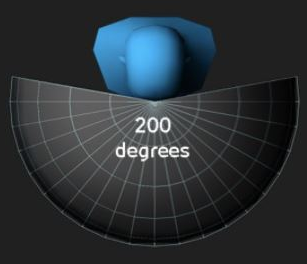

---
layout:
  width: default
  title:
    visible: true
  description:
    visible: false
  tableOfContents:
    visible: true
  outline:
    visible: true
  pagination:
    visible: true
  metadata:
    visible: true
---

# Aimbot

aim bot

The aimbot toggle. The aimbot will run while this is enabled

aim key

Its the aimbot's key. When holding the assigned key, the cheat will look for a target and try to aim at it

When no key is assigned, the aimbot will run unless the "aim bot" option is turned off

aim position

The preferred hitbox position to shoot/aim

aim fov

The aimbot's fiew of view (The maximum angle he can see)

Example:

<figure><figcaption>
source: <a href="https://www.google.com/url?sa=i&#x26;url=https%3A%2F%2Fdriver61.com%2Fsim-racing%2Fhow-to-set-fov-in-assetto-corsa-and-assetto-corsa-competizione%2F&#x26;psig=AOvVaw0yDK-29jYCBOJ6o-6zZtxA&#x26;ust=1756099822164000&#x26;source=images&#x26;cd=vfe&#x26;opi=89978449&#x26;ved=0CBgQjhxqFwoTCPCTh-vboo8DFQAAAAAdAAAAABAE">https://www.google.com/url?sa=i&#x26;url=https%3A%2F%2Fdriver61.com%2Fsim-racing%2Fhow-to-set-fov-in-assetto-corsa-and-assetto-corsa-competizione%2F&#x26;psig=AOvVaw0yDK-29jYCBOJ6o-6zZtxA&#x26;ust=1756099822164000&#x26;source=images&#x26;cd=vfe&#x26;opi=89978449&#x26;ved=0CBgQjhxqFwoTCPCTh-vboo8DFQAAAAAdAAAAABAE</a>
</figcaption></figure>

